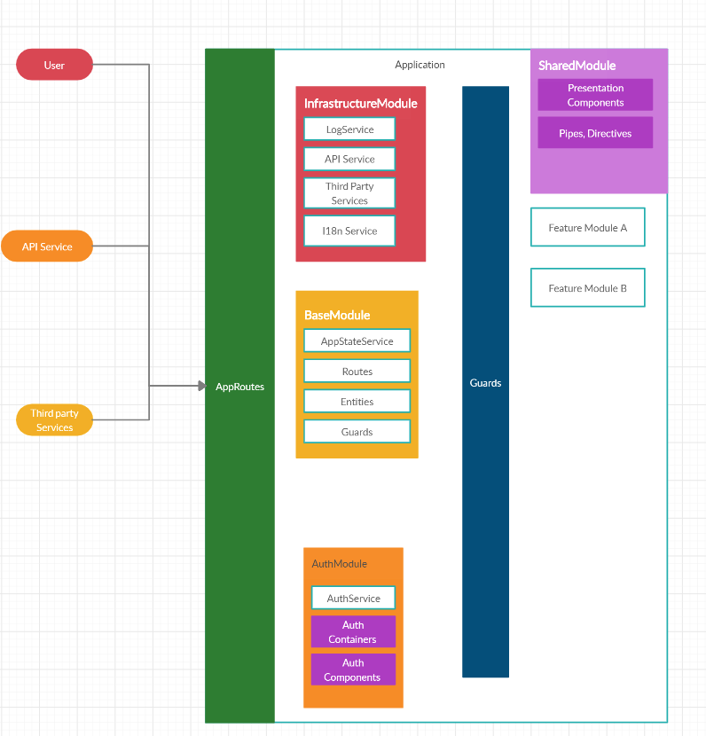

# Cs1HeadfirstAngular

## Angular App Architecture

> Version : 0.1
> Release Date: 2020-03-13



## Workflow

1. A module structure

```json
{
  "example": [
    "example.module.ts", // declare all elements in module
    "example-routing.module.ts", // declare entry components with routes
    "example-components.module.ts", // components placed here to allow sharing
    "components", // all presentation components in this module, can group by functionals
    "containers", // all container components in this module
    "services", // the service in this module
    "entities", // the defined entities in module - not required
    "repositories", // the repositories - not required
  ]
}
```

```bash
# generate new module with route
ng g module {modulename} --routing=true
# Add new route to this module in base route
# Import Shared Module into this new module

## Create
 ng g component example/components/example-item --module=example/example-components.module --skipTests=true

## Test all
ng test
## Test specific
ng test --include=src/app/core/services/log

## headless chromium

sudo apt-get install chromium-browser -y

```

## Angular Fundamentals

### Components

> To contrast the two types of components, there are components which are included in the template, which are declarative. Additionally, there are components which you load imperatively; that is, entry components.

**There are two main kinds of entry components:**

- The bootstrapped root component.
- A component you specify in a route definition.

> Angular router --> entry_components[]

![Entry components][entry_component]

### NgModules

> NgModules configure the injector and the compiler and help organize related things together.

#### Design Rules

> Component Independence : 
> - High cohesion
> - Low Coupling

> **Cohesion : **
> - The measure of the strength of functional relatedness of elements within a module
> - Elements: instructions, groups of instructions, data definition, call of another module
> - We aim for strongly cohesive modules
> - Everything in module should be related to one another - focus on the task
> - Strong cohesion will reduce relations between modules - minimise coupling

**Types of Cohesion : **

- **Functional cohesion (Most Required)**
- Sequential cohesion
- Communicational cohesion
- Procedural cohesion
- Temporal cohesion
- Logical cohesion
- **Coincidental cohesion (Least Required)**

> **Functional cohesion**:
> 
> - All elements contribute to the execution of one and only one problem-related task
> - Focussed - strong, single-minded purpose
> - No elements doing unrelated activities

**Examples of functional cohesive modules:**
> 
> - Compute cosine of angle
> - Read transaction record
> - Assign seat to airline passenger

**Some of bad design**

- Unrelated method to class
- Utility Class
- Hidden objects and subclasses

**Loose Coupling**


2. Service

- https://angular.io/guide/dependency-injection
- https://angular.io/guide/hierarchical-dependency-injection
- https://angular.io/guide/dependency-injection-providers
- https://angular.io/guide/dependency-injection-in-action
- https://angular.io/guide/singleton-services
- https://stackblitz.com/angular/omylrbvppab?file=src%2Fapp%2Fgreeting%2Fgreeting.module.ts
- https://angular.io/guide/ngmodule-faq#q-why-bad
- https://angular.io/guide/lazy-loading-ngmodules
- https://angular.io/guide/sharing-ngmodules


## Refs

- https://www.avatto.com/study-material/software-engineering-cohesion
- https://thebojan.ninja/2015/04/08/high-cohesion-loose-coupling/
- https://nehalist.io/working-with-models-in-angular/
- https://khalilstemmler.com/articles/typescript-domain-driven-design/ddd-frontend/

### Api initializer

- https://itnext.io/handle-restricted-routes-in-angular-with-route-guards-95c93be9d05e

### DI Providers

- https://angular.io/guide/dependency-injection-providers#factory-providers
- https://angular.io/api/core/APP_INITIALIZER#description
- https://www.tektutorialshub.com/angular/angular-how-to-use-app-initializer/#what-is-app-initializer
- https://dzone.com/articles/how-to-use-the-app-initializer-token-to-hook-into

> Sometimes you need to create a dependent value dynamically, based on information you won't have until run time. For example, you might need information that changes repeatedly in the course of the browser session. Also, your injectable service might not have independent access to the source of the information.

### Auth

- https://itnext.io/handle-restricted-routes-in-angular-with-route-guards-95c93be9d05e
- https://blog.bitsrc.io/how-to-mock-a-backend-in-angular-using-httpinterceptor-667794d45e8d
- https://blog.bitsrc.io/7-ways-to-leverage-httpinterceptors-in-angular-59436611844d
- https://angular.io/api/common/http/HttpInterceptor#description

### HTTP

- https://angular.io/guide/http#testing-for-errors

### Testing

- https://gist.github.com/ipepe/94389528e2263486e53645fa0e65578b
- https://developerslogblog.wordpress.com/2019/03/19/how-to-fix-no-binary-for-chrome-browser-on-your-platform/
- https://medium.com/angular-in-depth/angular-testing-with-headless-chrome-d1343b349699
- https://christianlydemann.com/all-you-need-to-know-about-mocking-in-angular-tests/
- https://stackoverflow.com/questions/43186533/unit-test-error-cannot-call-promise-then-from-within-a-sync-test

```javascript
// wrong
describe('someFunction', () => {
    const dependency = TestBed.get(Dependency); // this was causing the error

    it('should not fail', () => {
        someFunction(dependency);
    });
});

// fixed
describe('someFunction', () => {
    it('should not fail', () => {
        const dependency = TestBed.get(Dependency); // putting it here fixed the issue
        someFunction(dependency);
    });
});
```

### Optimzing

- https://blog.angular-university.io/how-does-angular-2-change-detection-really-work/
- https://apiumhub.com/tech-blog-barcelona/change-detection-angular/
- https://blog.bitsrc.io/3-ways-to-render-large-lists-in-angular-9f4dcb9b65
- https://medium.com/@vyakymenko/increasing-rendering-performance-in-angular-with-lazy-render-ngfor-ae8c5d16e194
- https://medium.com/@tharakamd.12/avoid-unnecessary-rendering-on-angular-ngfor-with-trackby-f56ae5d79561
- Angular CKD : https://web.dev/virtualize-lists-with-angular-cdk/
- https://blog.oasisdigital.com/2017/angular-runtime-performance-guide/
- https://www.gistia.com/insights/improve-angular-performance-efficiency

### Speed up development time

- https://bit.dev/

### Animations

- https://angular.io/guide/reusable-animations
- https://angular.io/guide/animations#animation-api-summary
- http://animationsftw.in/#/basics
- https://www.youtube.com/watch?v=JhNo3Wvj6UQ&feature=youtu.be&t=2h47m53s

[entry_components]: ./assets/entry-components.png


## Online Resource

- https://www.youtube.com/channel/UCzrskTiT_ObAk3xBkVxMz5g/videos
